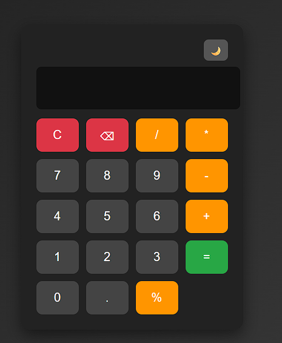

# 🧮 Calculadora Web

Una calculadora web moderna desarrollada con **HTML, CSS y JavaScript**.  
Permite realizar operaciones matemáticas básicas con una interfaz simple, dinámica y adaptable a dispositivos móviles.

---

## 🚀 Características

- ➕ Suma
- ➖ Resta
- ✖️ Multiplicación
- ➗ División
- % Cálculo de porcentaje
- 🔢 Soporte para números decimales
- ⌨️ Soporte para teclado
- 🌓 Cambio de modo claro / oscuro
- 📱 Diseño responsive para celulares
- ❌ Validación de error al dividir entre 0
- 🧹 Botón para limpiar y borrar

---

## 🛠️ Tecnologías utilizadas

- HTML5
- CSS3
- JavaScript

---

## 📱 Diseño responsive

La calculadora se adapta automáticamente a diferentes tamaños de pantalla, permitiendo su uso en:

- 💻 Computadoras
- 📱 Celulares
- 📲 Tablets

---

## ⌨️ Atajos de teclado

| Tecla | Acción |
|------|------|
| 0-9 | Ingresar números |
| + - * / | Operaciones |
| Enter | Calcular |
| Backspace | Borrar último número |
| Esc | Limpiar pantalla |

---

## 📂 Estructura del proyecto

calculadora-web
│
├── index.html

├── style.css

├── script.js

└── README.md
---
## ▶️ Cómo ejecutar el proyecto

1. Clonar el repositorio
2. Abrir el archivo
en cualquier navegador.

---

## 📸 Vista previa

---

## 👨‍💻 Autor

Desarrollado por **Juan Galvan**

---

## 📄 Licencia

Este proyecto es de uso libre para fines educativos.